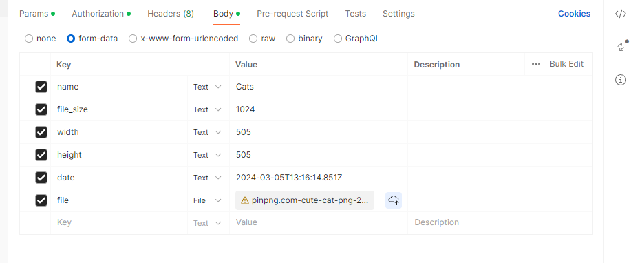

# Описание запросов

## GET запросы

* Получить все фото:
#### Путь: `````/api/photo`````
#### Возвращаемый объект:
```json
{
  "photos": [
    {
      "smallFilePath": "https://gallery-bucket.storage.yandexcloud.net/img_376288.png",
      "name": "Smile2"
    },
    {
      "smallFilePath": "https://gallery-bucket.storage.yandexcloud.net/img_376288.png",
      "name": "Mono"
    },
    {
      "smallFilePath": "https://gallery-bucket.storage.yandexcloud.net/small_photos/ae1e5675-1359-4367-b100-864856c4c7ad.jpg",
      "name": "Mono"
    }
  ]
}
```

* Получить оригинальное фото: 
#### Путь: `````/api/photo/original?smallFilePath=`````
#### Параметры:
* smallFilePath - путь до миниатюры
#### Возвращаемый объект:
Строка пути оригинальной фотографии

"https://gallery-bucket.storage.yandexcloud.net/original_photos/3e4bd381-be04-49a9-934a-ab761e7439e0.jpg"

* Получить детали фото:
#### Путь: `````/api/photo/original?smallFilePath=`````
#### Параметры:
* smallFilePath - путь до миниатюры
#### Возвращаемый объект:
```json
{
  "name": "Korella",
  "created_at": "2024-04-05T00:00:00.000Z",
  "file_size": 1024,
  "height": 505,
  "width": 505
}
```

## POST запросы
* Добавить фото:
#### Путь: `````/api/photo/`````
#### Тело запроса:


date передавать лучше в виде 

new Date().toJSON().toString()
#### Возвращаемый объект:
```json
{
  "message": "Photo was created!"
}
```
